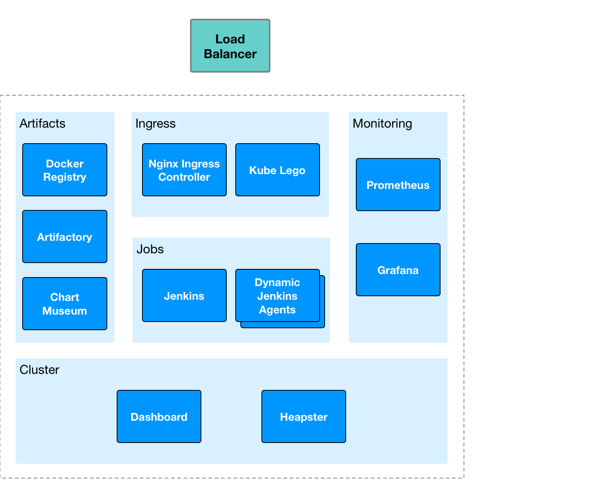

# Open Datacentre Mini

---

Open Datacentre Mini, aka **opendc-mini**, teaches how to build the components of a CI/CD platform using [Kubernetes](https://kubernetes.io) and [Helm](https://helm.sh).

---

## Pre-Requsities

It is expected that you have:

* Administrative access to a Kubernetes 1.7.x cluster.
* RBAC disabled (although a later version of **opendc-mini** may incorporate RBAC).
* A local installation of `kubectl` that is configured to access the Kubernetes cluster.
* Control of DNS zone records if using `Kube Lego`.

## Architecture

The following diagram shows a simplified view of the overall solution architecture that will be built through the labs of this course.

